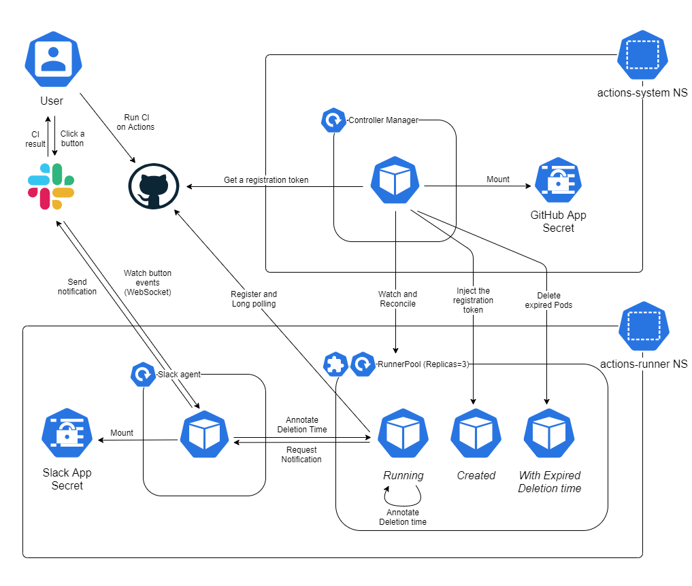

Design notes
============

Motivation
----------

To run GitHub Actions [self-hosted runners](https://docs.github.com/en/actions/hosting-your-own-runners/about-self-hosted-runners)
faster and stably by making full use of idle machine resources.

Word Definition
---------------

- Workflow: GitHub Actions [workflow](https://docs.github.com/en/actions/reference/workflow-syntax-for-github-actions)
  defined in one YAML file as a unit (e.g. `.github/workflows/main.yaml`).
- Job: Job is a user-defined sequence of commands defined under `jobs`.
  A workflow consists of a/some job(s).
- Runner: Machine or container a GitHub Actions workflow runs on. In this document,
  you can read the word "runner" as "self-hosted runner".

Goals
-----

- Deploy and manage GitHub Actions self-hosted runners on multiple servers easily
  by using Kubernetes.
- Enable runners to finish a time-consuming initialization step before jobs are
  assigned in order not to make users wait longer.
- Extend lifetime of runners from outside when jobs are failed, to investigate
  what causes the failure.
- Notify users whether jobs are failed or not via Slack and extend the lifetime
  from Slack.

Non-Goals
---------

- Autoscaling

Components
------------

- Runner `Pod`: `Pod` to run GitHub Actions self-hosted runner on.
- Controller manager
  - `RunnerPool` reconciler: A controller for the `RunnerPool` custom resource(CR).
  -  `Pod` Mutating webhook: A mutating webhook to inject a GitHub Actions
     registration token to `Pod` `env`.
  - Runner sweeper: A component to sweep registered information about runners
    on GitHub periodically.
  - `Pod` sweeper: A component to sweep Pods which exceeds the deletion time
    annotation periodically.
- Slack agent
  - Notifier: HTTP Server which accepts requests from runner `Pod`s and notify user
    whether jobs are failed or not via Slack Webhook.
  - Extender: WebSocket client which watches Slack button events and extends the
    lifetime of a `Pod` by annotating the `Pod` with the extended deletion time.

Architecture
------------

### How GitHub Actions schedules jobs on self-hosted runner

GitHub Actions schedules jobs on runners in the ways written in this section.

#### How runner is registered

The following steps are needed to register a runner on GitHub Actions.

1. Fetch a registration token via GitHub Actions [API](https://docs.github.com/en/rest/reference/actions#create-a-registration-token-for-a-repository).
1. Execute [`config.sh`](https://github.com/actions/runner/blob/main/src/Misc/layoutroot/config.sh)
  to configure a runner.
1. Execute [`Runner.Listener`](https://github.com/actions/runner/blob/main/src/Runner.Listener/Program.cs) to start the long polling for GitHub Actions API.

`Runner.Listener` start a long polling in the end, and `cmd/entrypoint/cmd/root.go#runService`
handles some errors and then restarts the `Runner.Listener` automatically for upgrade themselves.
They upgrade the binary by themselves when a new release is out. This help
us avoid unnecessary `Pod` recreation.

#### `Runner.Listener` should be executed right after `config.sh`

We should execute `Runner.Listener` within about 30 seconds after executing `config.sh`.
After that, `Runner.Listener` fails to open a connection with GitHub Actions
API.  Note that this behavior is not clearly written in the official documentation
and might change unexpectedly.

#### How runner state is managed on GitHub Actions API

Runner has the `status` and `busy` state as written [here](https://docs.github.com/en/rest/reference/actions#get-a-self-hosted-runner-for-a-repository).

- `status`:
  - `online`: The runner is running a long polling.
  - `offline`: The runner is NOT running a long polling.
- `busy`:
  - `true`: The runner is running a workflow.
  - `false`: The runner is NOT running a workflow.

If the `--once` option is given to `Runner.Listener` does not repeat the
long polling again, and never gets `online` after the assigned job is done.
This behavior is useful for ensuring to make a clean environment for each job.

#### A job is scheduled only on a `online` runner

Some experiments reveal the following behaviors.
Note that this behavior is not clearly written in the official documentation
and might change unexpectedly.

- If there is no `online` runners at the time a job is created, the job is not
  scheduled on any runner.
- If there is any `online` and non-`busy` runner at the time a job is created,
  the job is scheduled one of the runners.
- If all the runners are `online` and `busy` at the time a job is created, the
  job is queued first and then scheduled right after any runner finishes its job
  and gets non-`busy`.
  - Even if `Runner.Listener` runs with the `--once` option, a job is assigned on the
    runner doing a job and never proceeds. This seems to be because the runner is
    recognized as `online` at the very time the job is done, but it gets `offline`
    when the job actually starts. In this situation, the job can be canceled only
    after 5 minutes or more passed. This happens only when there is no `online`
    and non-`busy` runner, but might be problematic.
- If all the runners are `online` and `busy` at the time a job is created and
  then a runner is created before any existing runner finishes its job, the job
  is scheduled on the newly created runner.
- Two identical runners registered with the same name are recognized as the same
  runner. If one runner dies `offline` holding a unprocessed job and another
  runner is created with the same name, the new runner starts the job once it
  gets `online`.

### Runners can have multiple custom labels

The [custom label](https://docs.github.com/en/actions/hosting-your-own-runners/using-labels-with-self-hosted-runners)
is a label to route jobs to specific types of runners. Users usually use
self-hosted runners by setting `self-hosted` to `runs-on` in a workflow
definition. If custom labels are given, users are allowed to set one of the
custom label value to `runs-on`. This is useful when you want to use multiple
types of runners, for example, `highmem`and `highcpu`.

github-actions-controller sets the namespaced name of a `RunnerPool` as a custom label.

### How self-hosted runners are created and runs jobs

1. The `RunnerPool` reconciler watches `RunnerPool` creation events and creates
  a `Deployment` which own runner `Pod`s. The controller adds some labels to
  `Pod`s to tell other components like webhook that the `Pod`s are managed by
  the controller. After these steps, Other components recognize which `Pod`s
  they should handle with those labels.
1. The mutating webhook creates registration tokens via GitHub API and injects
  them to the `Pod`s' `env` fields.
1. Each runner `Pod` does the following steps.
   1. Register itself as a self-hosted runner with the injected token.
   1. Initialize runner environment by doing the user-defined process.
   1. Start a long polling process and wait for GitHub Actions to assign a job.
   1. Run an assigned job.
   1. Call the Slack agent to notify users. GitHub API does not seem to provide
      a way to know which runner ran a succeeded or failed job. So, this repository
      provides a simple `job-failed` command, and asks users to execute this
      command when the job is failed.  The `if: failure()` syntax allows users
      to run the step only when one of previous steps exit with non-zero code.
   1. Annotate the `Pod` manifest for itself with a timestamp when to delete this
     `Pod`. If the job is succeeded or canceled, the `Pod` annotates itself with
      the current time. If the job is failed, the `Pod` annotate itself with the
      future time, for example 20 min later.
1. The Slack agent notifies the result of the job on a Slack channel.
1. Users can extend the failed runner if they want to by clicking a button on Slack.
1. The Slack agent is running a WebSocket process to watch extending messages
  from Slack. If it receives a message, it annotates the `Pod` manifest with the
  designated time.
1. `Pod` sweeper periodically checks if there are `Pod`s annotated with the old
  timestamp, and if any, it deletes `Pod`s.

### How Runner's state is managed

A Runner `Pod` has the following state as a GitHub Actions job runner.

- `initializing`: `Pod` initializing. Prepare the necessary environment for Job.
    for example, booting a couple of VMs needed in a job before the job is assigned.
- `running`: `Pod` is running. Registered in GitHub Actions.
- `debugging`: The job has finished with failure and Users can enter `Pod` to debug.

In addition, it has the following states as the exit state of the execution result of `Runner.Listener`.

- `retryable_error`: If execution fails due to a factor other than a job, restart `Runner.Listener`.
- `updating`: When a new `Runner.Listener` is released, it updates itself and restarts` Runner.Listener`.
- `undefined`: When the exit code of `Runner.Listener` is undefined. It restarts` Runner.Listener`.

The above states are exposed from `/metrics` endpoint as Prometheus metrics. See [metrics.md](metrics.md).

Detailed `running` state of the runner as seen on GitHub is not provided
in the `/metrics` endpoint of the runner `Pod`.
Because those detailed states are going to be provided metrics by controller based
on the [state](design.md#how-runner-state-is-managed-on-github-actions-api) that
controller can get from GitHubActionsAPI.

### Why is webhook used

This is mainly because a GitHub Actions registration token expires after 1 hour as
written [here](https://docs.github.com/en/rest/reference/actions#create-a-registration-token-for-a-repository).
Runner `Pod`s should not fetch the token by themselves because the permission
required to get the token is so strong that, for example, it can delete the
repository and we need to make another component responsible for registering tokens.

- If a token is given in the `env` field in a pod template of `Deployment`, `Pod`
  cannot register itself again when recreated.
- If a token is given with a `Secret` resource mounted on the `Pod`, recreated
  `Pod`s can access an updated token.
  However, webhook is simpler because only the webhook is responsible for tokens.
  Both a controller and a periodical runner have to take responsibility to manage
  tokens in this alternative design.
- If a token is given in the `env` field in a pod template of `Deployment` and
  `Pod` restarts by having liveness probe fail, `Pod`s do not need to re-register
  itself to GitHub Actions.
  However, if `Pod`s are recreated in some reasons, it cannot register itself again.
- Persistent volumes can store the resitration information, but stateful workloads
  are generally more diffcult to manage than stateless workloads.

Update:  
Originally, `Runner.Listener` is thought to be able to run in 1 hour or more after
`config.sh` is done, but it turns out that we should execute `Runner.Listener` within
about 30 seconds after executing `config.sh`. This means that `config.sh` which
registers a runner on GitHub has to run after the initialization step.
So, an initialization step might be time-consuming, but it's limited to finishing
a job in 1 hour in the current design.

This might be improved by taking the way that the controller updates a `Secret`
periodically. Otherwise, we have to create a server responsible for getting
registration tokens and have runners make a request for the server to get a
token right after the initialization is done.
