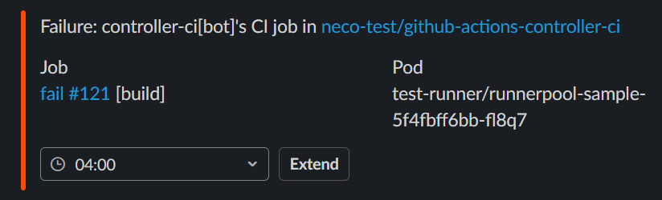

# User Manual

## Installation

### Preparation

meows depends on the [cert-manager](https://cert-manager.io/docs/). If you are not installing the cert-manager on your Kubernetes cluster, install it as follows:

```bash
$ curl -fsLO https://github.com/jetstack/cert-manager/releases/latest/download/cert-manager.yaml
$ kubectl apply -f cert-manager.yaml
```

You need to manually create a secret and a configmap in the `meows` namespace at the initial deployment.
So make the `meows` namespace to prepare.

```bash
$ kubectl create namespace meows
```

### Deploying Controller

Currently, meows can manage one organization.
So set the target organization by `meows-cm` ConfigMap.

```bash
$ GITHUB_ORG=<your Organization>
$ kubectl create configmap meows-cm -n meows \
    --from-literal=organization=${GITHUB_ORG}
```

After that deploy the controller.

```bash
$ MEOWS_VERSION=$(curl -s https://api.github.com/repos/cybozu-go/meows/releases/latest | jq -r .tag_name)
$ kustomize build github.com/cybozu-go/meows/config/controller?ref=${MEOWS_VERSION} | kubectl apply -f -
```

### Deploying Slack Agent

Next, deploy the slack agent.
The agent requires Slack App tokens, so create a Slack App following [Creating Slack App](#creating-slack-app) section.
And create a secret as follows:

```bash
$ SLACK_CHANNEL="#<your Slack Channel>"
$ SLACK_APP_TOKEN=<your Slack App Token>
$ SLACK_BOT_TOKEN=<your Slack Bot Token>

$ kubectl create secret generic slack-app-secret -n meows \
    --from-literal=SLACK_CHANNEL=${SLACK_CHANNEL} \
    --from-literal=SLACK_APP_TOKEN=${SLACK_APP_TOKEN} \
    --from-literal=SLACK_BOT_TOKEN=${SLACK_BOT_TOKEN}
```

After that deploy the agent.

```bash
$ MEOWS_VERSION=$(curl -s https://api.github.com/repos/cybozu-go/meows/releases/latest | jq -r .tag_name)
$ kustomize build github.com/cybozu-go/meows/config/controller?ref=${MEOWS_VERSION} | kubectl apply -f -
```

## Creating RunnerPool

After deploying the controller, let's create `RunnerPool` resources to register self-hosted runners.

In meows, you can change the GitHub Credential for each RunnerPool.
In other words, you need to create a Secret that records the credential in the RunnerPool's namespace before.

### Creating RunnerPool's namespace

If you have not created a RunnerPool's namespace yet, please create as follows.

```bash
$ RUNNERPOOL_NAMESPACE=<your RunnerPool namespace>
$ kubectl create namespace ${RUNNERPOOL_NAMESPACE}
```

### Creating GitHub Credential Secret

meows supports two ways of GitHub authentication:

1. GitHub App
2. Personal Access Token (PAT)

There is no functional difference between these two authentications.

If you want to use a GitHub App, create a GitHub App and download a private key file following [Creating GitHub App](#creating-github-app) section.
And create a secret as follows:

```bash
$ RUNNERPOOL_NAMESPACE=<your RunnerPool namespace>
$ GITHUB_APP_ID=<your GitHub App ID>
$ GITHUB_APP_INSTALLATION_ID=<your GitHub App Installation ID>
$ GITHUB_APP_PRIVATE_KEY_PATH=<Path to GitHub App private key file>

$ kubectl create secret generic github-cred -n ${RUNNERPOOL_NAMESPACE} \
    --from-literal=app-id=${GITHUB_APP_ID} \
    --from-literal=app-installation-id=${GITHUB_APP_INSTALLATION_ID} \
    --from-file=app-private-key=${GITHUB_APP_PRIVATE_KEY_PATH}
```

If you want to use a Personal Access Token (PAT), create a PAT following [the official documentation](https://docs.github.com/en/authentication/keeping-your-account-and-data-secure/creating-a-personal-access-token).

Then:
- Set the `repo` scope, if you want to use a repository-level runner.
- Set the `admin:org` scope, if you want to use an organization-level runner.

And create a secret as follows:

```bash
$ RUNNERPOOL_NAMESPACE=<your RunnerPool namespace>
$ GITHUB_TOKEN=<your PAT>

$ kubectl create secret generic github-cred -n ${RUNNERPOOL_NAMESPACE} \
    --from-literal=token=${GITHUB_TOKEN}
```

NOTE: The meows controller loads the credential when the controller reconcile the RunnerPool creation or when the controller starts.
And the controller will not reflect the secret update while running.
If you want to change the secret, recreate the RunnerPool or restart the controller.

### Deploying RunnerPool resource

Here is an example of the RunnerPool resource.

```yaml
apiVersion: meows.cybozu.com/v1alpha1
kind: RunnerPool
metadata:
  name: runnerpool-sample
  namespace: <your RunnerPool namespace>
spec:
  repositoryName: "<your Repository>"
  replicas: 3
  slackAgent:
    serviceName: slack-agent.meows.svc
```

When you create the above RunnerPool, meows creates three runner pods (the number is specified by `.spec.replicas`) in `<your RunnerPool namespace>`.
Then, meows registers each runner pod as a repository-level runner in the specified repository(`.spec.repositoryName`).

After running pods, you can check whether the runners are registered to GitHub on the **Actions** page under each repository's **Settings**.
E.g. `https://github.com/<your Organization>/<your Repository>/settings/actions/runners`

## Writing Workflow

There are a few tips using runners registered by meows.

1. Runners have a specific label determined from the name and namespace of the RunnerPool.
   - The format is `<your RunnerPool Namespace>/<your RunnerPool Name>`.
2. Users must call these commands in their workflows.
   - At the beginning of a job, call `job-started`.
   - At the ending of a job, call `job-success`, `job-cancelled` and `job-failure` with `steps.if` conditions.

Here is an example of a workflow definition.

```yaml
name: workflow example
on: push

jobs:
  example:
    name: example
    runs-on: ["self-hosted", "<your RunnerPool Namespace>/<your RunnerPool Name>"] # Specify `self-hosted` and the RunnerPool-specific label.
    steps:
      - run: job-started # Call `job-started` at the beginning of a job.

      - run: ...
      - run: ...
      - run: ...

      - if: success() # Call `job-{success, cancelled, failure}` at ending of a job.
        run: job-success
      - if: cancelled()
        run: job-cancelled
      - if: failure()
        run: job-failure
```

## Slack notifications

By default, meows sends the job result to the slack channel specified by the `slack-app-secret` secret.
However, you can change the slack channel in several methods.
Each method accepts a channel name in the `#<channel_name>` format. (e.g. `#general`, `#test1`)

1. Call `meows slackagent set-channel "#channel"` command in a workflow.
2. `MEOWS_SLACK_CHANNEL` environment variable in a job.
3. `.spec.slackAgent.channel` field in a `RunnerPool` resource. See [SlackAgentConfig](crd-runner-pool.md#SlackAgentConfig).
4. `SLACK_CHANNEL` value in the `slack-app-secret` secret. See [Deploying Slack Agent](#deploying-slack-agent).

When you specify some channels using some methods, the smaller number is a priority.
If you don't set any channel in any method, meows does not send a message.

For example, you can specify the channel in a workflow as follows.

```yaml
name: slack notification example
on: push

jobs:
  example:
    name: example
    env:
      # Basically, a job result will be reported to the "#test1" channel.
      MEOWS_SLACK_CHANNEL: "#test1"
    steps:
      - run: job-started

      # Only when a job fails, the result will be reported to the "#test2" channel.
      - if: failure()
        run: meows slackagent set-channel "#test2"

      - run: ...
      - run: ...
      - run: ...

      - if: success()
        run: job-success
      - if: cancelled()
        run: job-cancelled
      - if: failure()
        run: job-failure
```

## Runner pods extension

When a job fails, meows sends the following Slack message.



If you want to extend the pod, choose the time in UTC and click the `Extend` button.
As long as the pod exists, you can extend it as many times as you want.

## Appendix

### Creating GitHub App

If you want to use a GitHub App, please create a GitHub App following [the official documentation](https://docs.github.com/en/developers/apps/creating-a-github-app).

Here are the minimal changes from the default setting on the registration page:

- Fill **GitHub Apps Name**
- Fill **Homepage URL**
- Uncheck `Active` under **Webhook** section
- Set **Administration** `Read & Write` permission to the repository scope, if you want to use a repository-level runner.
- Set **Self-hosted runners** `Read & Write` permission to the organization scope, if you want to use an organization-level runner.

Then, you are redirected to the **General** page and what you should do is:

1. Click `Generate a private key` and downloads the generated private key.
2. Keep `App ID` shown on the top of the page somewhere.

Next, you should proceed to the Install App page from the sidebar and click the
`Install` button. You are asked to give the permission to `All repositories`
or `Only select repositories`. `Only select repositories` is recommended because
the permission is very strong. You should decide the scope wide enough depending on
how you use this controller.

Finally, you should get the installation ID from the URL of the page to which you are
redirected. The URL should look like `https://github.com/organizations/cybozu-go/settings/installations/12345`
and `12345` is your installation ID.

### Creating Slack App

The Slack agent notifies users whether CI succeeds or not and receives messages to extend a runner pod lifetime.
So, users have to prepare a Slack App to send messages to and run a WebSocket client to watch button events.

Here's a procedure for how to configure the Slack App.

1. Go to [this](https://api.slack.com/apps) page.
2. Click the **Create New App** button.
   - Choose **From scratch**.
   - Fill the application name field and choose a Slack workspace.
3. Go to **Socket Mode** from the sidebar.
   - Enable **Enable Socket Mode**.
   - Create App-Level Token on the windows coming up and keep the generated App Token.
4. Go to **OAuth & Permissions** from the sidebar.
   - Add the `chat:write` permission under **Bot Token Scopes**.
5. Go to **Basic Information** from the sidebar.
   - Make sure **Bots** is enabled in `Add features and functionality`
   - Click **Install(Reinstall) to Workspace** in `Install your app` and (re)install the bot in your desired channel.
6. Go to **OAuth & Permissions** from the sidebar again.
   - Keep **Bot User OAuth Token**.
7. Open your Slack desktop app and go to your desired channel.
   - Click the `i` button on the top right corner.
   - Click **more** and then **Add apps**.
   - Add the created Slack App to the channel.
